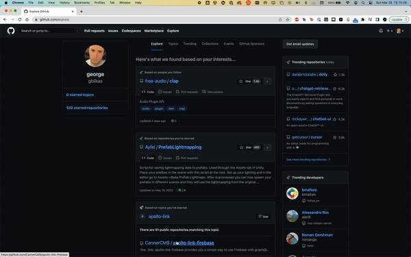

# Chrome Element Inspector

[](https://github.com/gblikas/chrome-element-inspector/blob/main/LICENSE)
[](https://GitHub.com/gblikas/chrome-element-inspector/releases/)
[](https://GitHub.com/gblikas/chrome-element-inspector/releases/)

> Chrome Element Inspector is a powerful chrome extension tool built with Vite and Vanilla, using Manifest v3. It allows you to easily inspect the elements of any website and make changes to the DOM.

...

## Features and About

- All code and refactor generated with ChatGPT
- Manifest v3
- Typescript
- Vite
- Prism for code highlighting
- Hover over elements to see a Chrome DevTools like overlay, and interact.
- Implement [ShadowDOMComponent](./src/content/ShadowDOMComponent.ts) to hook into Inspector events.

This project was an exercise in ChatGPT, and a Chrome Extensions MV3 makeover. It's also been moved to a typescript interface, so it's more maintainable.

Weirdly enough, although this project is chrome-extension ready, it isn't available on the store, although the repo will product ready code for it. The main issue with this is the extensibility for the developer. This tool is designed to be extended and fit your use case.

## Demo



## Installing

1. Check if your `Node.js` version is >= **14**.
2. Change or configurate the name of your extension on `src/manifest`.
3. Run `npm install` to install the dependencies.

## Developing

run the command

```shell
$ cd chrome-element-inspector

$ npm run dev
```

The [ShadowDOMComponent](./src/content/ShadowDOMComponent.ts) system was designed for easy extension. You can add your own components to the inspector, and hook into the events. Check out the [Inspector](./src/content/Inspector.ts) class for more info. Specifically, the "activate" method, where you create your class instance and hook everything up.

### Chrome Extension Developer Mode

1. set your Chrome browser 'Developer mode' up
2. click 'Load unpacked', and select `chrome-element-inspector/build` folder

## Packing

After the development of your extension run the command

```shell
$ npm build
```

Now, the content of `build` folder will be the extension ready to be submitted to the Chrome Web Store. Just take a look at the [official guide](https://developer.chrome.com/webstore/publish) to more infos about publishing.

---

## Contributors

This project template was generated by [create-chrome-ext](https://github.com/guocaoyi/create-chrome-ext). The original code was originally inspired from this awesome project: [ilyashubin/hover-inspect](https://github.com/ilyashubin/hover-inspect).
